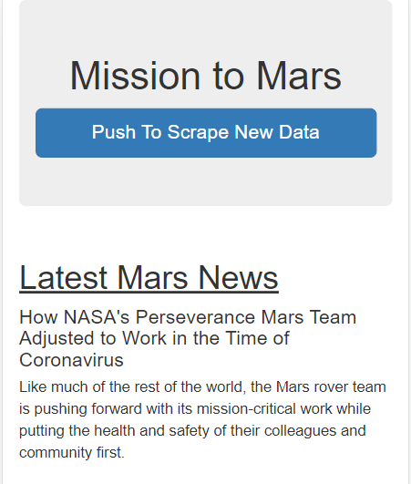
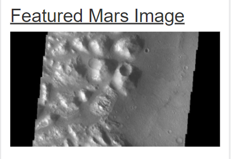
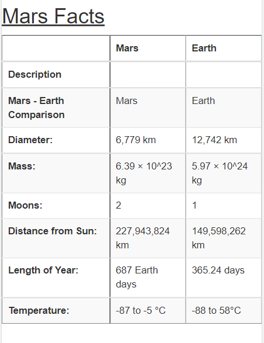
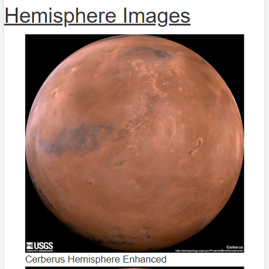

# Mission to Mars (Module 10)

**CHALLENGE RE-SUBMITTAL**

Added two additional Bootstrap elements to index.html code:
* Changed scrape button color to light blue
* Updated title and key headers to bold text

[Link to mission_to_mars_challenge code](mission_to_mars_challenge2.ipynb)

[Link to scraping.py code](apps/scraping.py)

[Link to app.py code](apps/app.py)

[Link to index.html code](apps/templates/index.html)

## Overview of Mission to Mars Analysis

### Purpose
Used BeautifulSoup and Splinter to scrape information about Mars, store the scraped data on a Mongo database, use a web application to display the data, and alter the design of the web app to display the information.
* Optimized the web app to appear on an Apple iPhone SE device screen
* Added Bootstrap elements to make the scape button wider (block) and underlined key headers

Provided the following:

1. Latest Mars News

2. Featured Mars Image

3. Mars Facts

4. Mars Hemisphere Images

### Resources

This project was prepared using the following:
* Python 3.7.6
* Anaconda 4.12.0
* Jupyter Notebook 6.4.5
* MongoDB v5.0.8
* Flask
* Splinter
* BeautifulSoup

Source websites

https://redplanetscience.com/

https://spaceimages-mars.com/

https://astrogeology.usgs.gov/search/results?q=hemisphere+enhanced&k1=target&v1=Mars
